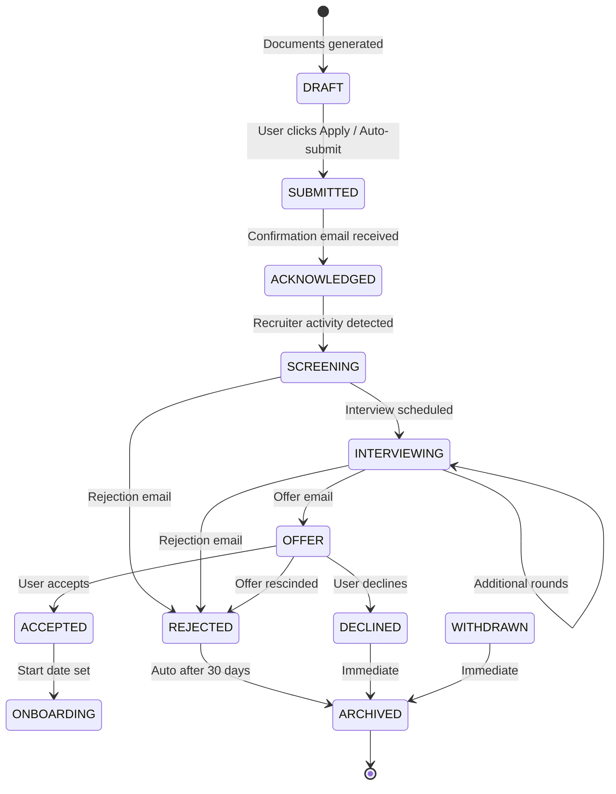

# Application Flow Document (AppFlow)
## AI-Powered Job Application Automation Platform

---

## 1. User Journey Overview

```
┌─────────────────────────────────────────────────────────────────────────────────┐
│                        COMPLETE USER LIFECYCLE                                   │
└─────────────────────────────────────────────────────────────────────────────────┘

  ONBOARDING                    DAILY OPERATIONS                    ONGOING
  ┌─────────────┐               ┌─────────────────┐                 ┌───────────┐
  │  Sign Up    │               │  Morning        │                 │  Profile  │
  │  & Auth     │──────────────▶│  Digest Email   │───────────────▶│  Refinement│
  └─────────────┘               └────────┬────────┘                 └───────────┘
         │                                │                              │
         ▼                                ▼                              ▼
  ┌─────────────┐               ┌─────────────────┐                 ┌───────────┐
  │  Profile    │               │  Dashboard      │                 │  Source   │
  │  Wizard     │──────────────▶│  Review         │───────────────▶│  Mgmt     │
  │  (5 steps)  │               │  Top Matches    │                 │  (Add/    │
  └─────────────┘               └────────┬────────┘                 │  Edit)    │
         │                                │                         └───────────┘
         ▼                                ▼                              │
  ┌─────────────┐               ┌─────────────────┐                      │
  │  CV Upload  │               │  Document       │                      │
  │  & Index    │──────────────▶│  Generation     │                      │
  │  (Async)    │               │  (Review/Edit)  │                      │
  └─────────────┘               └────────┬────────┘                      │
         │                                │                              │
         ▼                                ▼                              ▼
  ┌─────────────┐               ┌─────────────────┐                 ┌───────────┐
  │  Source     │               │  Application    │                 │  Email    │
  │  Config     │──────────────▶│  Submission     │◀───────────────▶│  Monitor  │
  │  (1-click)  │               │  (Auto/Manual)  │                 │  (Sync)   │
  └─────────────┘               └────────┬────────┘                 └───────────┘
                                        │
                                        ▼
                               ┌─────────────────┐
                               │  Pipeline       │
                               │  Tracking       │
                               │  (Kanban)       │
                               └─────────────────┘
```

---

## 2. Detailed User Flows

### 2.1 Flow: First-Time Onboarding (FTO)

#### Entry Points
- Landing page "Get Started" → `/onboarding`
- Email invitation link → `/onboarding?token=xyz`

#### Step-by-Step Flow

| Step | Screen | Actions | Validation | Exit Criteria |
|------|--------|---------|------------|---------------|
| 1 | **Welcome & Auth** | Email/password or OAuth (Google, GitHub, LinkedIn) | Valid email, strong password (zxcvbn > 3), email verification | Verified account |
| 2 | **Professional Identity** | Headline, summary, years exp, current role, location | Headline ≤ 120 chars, summary ≤ 500 chars | Profile saved |
| 3 | **Skills & Expertise** | Multi-select technical skills (typeahead from 5000+), proficiency (1-5), years | Min 5 skills, at least 1 "expert" | Skills indexed |
| 4 | **Preferences** | Target roles (multi), locations (city + remote toggle), salary range, employment types, visa status | Salary min < max, at least 1 role + 1 location | Preferences saved |
| 5 | **CV Upload** | Drag-drop PDF/DOCX (max 10MB), parse preview, confirm sections | Valid file, parsed sections ≥ 3 (exp, edu, skills) | CV queued for indexing |
| 6 | **Source Quick-Start** | One-click connects: LinkedIn RSS, Indeed email, Telegram channels, Company career pages | At least 1 source configured | Sources active |
| 7 | **Success** | Dashboard tour tooltip, first pipeline run triggered | - | Redirected to dashboard |

#### State Machine
```
UNAUTHENTICATED → AUTHENTICATED → PROFILE_INCOMPLETE → CV_PROCESSING → SOURCES_CONFIGURED → ACTIVE
                                    ↑                  │
                                    └──────────────────┘ (can skip, return later)
```

#### Error Handling
- CV parse failure → Show raw text, allow manual entry, retry with different parser
- Skill extraction confidence < 0.7 → Flag for review
- OAuth scope denied → Graceful fallback to email/password

---

### 2.2 Flow: Daily Automated Pipeline (DAP)

#### Trigger
- Cron: `0 6 * * *` (user timezone) via n8n
- Manual: "Run Now" button on dashboard
- Webhook: New job posted to monitored source

#### Pipeline Stages

```
┌──────────────┐   ┌──────────────┐   ┌──────────────┐   ┌──────────────┐
│  COLLECT     │──▶│  NORMALIZE   │──▶│  DEDUPLICATE │──▶│  ENRICH      │
│  (Parallel)  │   │  (LLM)       │   │  (Fuzzy +    │   │  (Company    │
│  - RSS       │   │  - Extract   │   │   Embedding) │   │   API)       │
│  - API       │   │  - Validate  │   │  - Merge     │   │  - Size      │
│  - Playwright│   │  - Schema    │   │  - Flag      │   │  - Industry  │
│  - Email     │   │  - Confidence│   │  - Keep best │   │  - Tech Stack│
└──────────────┘   └──────────────┘   └──────────────┘   └──────────────┘
       │                │                │                │
       ▼                ▼                ▼                ▼
   Raw Jobs         Clean Jobs       Unique Jobs      Enriched Jobs
   (JSON/HTML)      (Validated)      (Merged)         (Company Data)
```

#### Scoring & Generation Branch
```
┌──────────────┐   ┌──────────────┐   ┌──────────────┐   ┌──────────────┐
│  SCORE       │──▶│  RANK &      │──▶│  GENERATE    │──▶│  QUEUE       │
│  (Batch)     │   │  FILTER      │   │  DOCUMENTS   │   │  APPLICATIONS│
│  - Vector    │   │  - Top 50    │   │  - CV Tailor │   │  - ATS API   │
│  - Keyword   │   │  - Threshold │   │  - Cover     │   │  - Portal    │
│  - Heuristic │   │  - Diversity │   │  - Template  │   │  - Manual    │
└──────────────┘   └──────────────┘   └──────────────┘   └──────────────┘
```

#### Notification Trigger
```
IF (new_high_match_count > 0) OR (applications_submitted > 0) OR (interview_invites > 0)
THEN send_digest_email() + push_notification()
```

#### Monitoring Dashboard (Real-time)
| Metric | Green | Yellow | Red |
|--------|-------|--------|-----|
| Sources successful | 100% | 80-99% | <80% |
| Jobs collected | >100 | 50-100 | <50 |
| Duplicates rate | <5% | 5-15% | >15% |
| Scoring latency | <3min | 3-10min | >10min |
| Generation queue | <10 | 10-50 | >50 |

---

### 2.3 Flow: Job Review & Document Generation (JRG)

#### Entry Points
- Dashboard "Top Matches" card click
- Email digest "View Job" link
- Direct URL `/jobs/:id`

#### Screen: Job Detail Modal
```
┌─────────────────────────────────────────────────────────────────┐
│  [Company Logo]  Senior Python Engineer          Score: 92/100  │
│  📍 San Francisco, CA (Hybrid)  💰 $180k-$220k  🏢 Series B (50) │
│  ─────────────────────────────────────────────────────────────  │
│  MATCH BREAKDOWN                              [View Reasoning]  │
│  ████████████████████████ Skills Match: 95%                     │
│  ██████████████████████    Experience: 88%                       │
│  ████████████████████████ Location: 95%                          │
│  ████████████████████     Salary: 90%                            │
│  ██████████████████       Culture: 85%                           │
│  ─────────────────────────────────────────────────────────────  │
│  [Job Description]                              [Requirements]  │
│  ─────────────────────────────────────────────────────────────  │
│  [Generate Documents]  [Save for Later]  [Not Interested]       │
└─────────────────────────────────────────────────────────────────┘
```

#### Document Generation Flow
```
User clicks "Generate Documents"
       │
       ▼
┌──────────────────┐
│  Loading State   │  (WebSocket progress: CV 45% → CL 78% → PDF 100%)
│  - Streaming     │
│  - Cancelable    │
└────────┬─────────┘
         │
         ▼
┌──────────────────┐
│  Review Screen   │  Side-by-side: Original | Tailored
│  ┌──────┬──────┐ │
│  │ CV   │ CV   │ │  - Highlighted changes (green/red)
│  │ Orig │ New  │ │  - Accept/Reject per bullet
│  └──────┴──────┘ │
│  ┌──────┬──────┐ │
│  │ CL   │ CL   │ │
│  │ Orig │ New  │ │
│  └──────┴──────┘ │
│  [Regenerate] [Download PDF] [Apply Now]                    │
└──────────────────┘
```

#### Apply Now Sub-flow
```
[Apply Now] clicked
       │
       ▼
┌──────────────────┐
│  Submission Mode │
│  ┌─────────────┐ │
│  │ ☐ Auto      │ │  (ATS API available)
│  │ ☐ Assisted  │ │  (Portal automation)
│  │ ☐ Manual    │ │  (Download docs, user submits)
│  └─────────────┘ │
│  [Confirm]       │
└────────┬─────────┘
         │
         ▼
┌──────────────────┐
│  Processing      │  Real-time logs:
│  - Filling form  │  "Navigating to careers.page..."
│  - Uploading     │  "Filling personal info..."
│  - Submitting    │  "Uploading CV..."
│  - Verifying     │  "Submitted! Confirmation #12345"
└────────┬─────────┘
         │
         ▼
┌──────────────────┐
│  Success Screen  │
│  ✓ Application   │
│    submitted     │
│  [View in Pipeline] [Add Note] [Schedule Follow-up]      │
└──────────────────┘
```

---

### 2.4 Flow: Application Pipeline Management (APM)

#### Kanban Board View
```
┌─────────────┐ ┌─────────────┐ ┌─────────────┐ ┌─────────────┐ ┌─────────────┐
│  APPLIED    │ │  SCREENING  │ │ INTERVIEWING│ │   OFFER     │ │  ARCHIVED   │
│  (12)       │ │  (3)        │ │  (2)        │ │  (1)        │ │  (45)       │
├─────────────┤ ├─────────────┤ ├─────────────┤ ├─────────────┤ ├─────────────┤
│ □ Job Card  │ │ □ Job Card  │ │ □ Job Card  │ │ □ Job Card  │ │ □ Job Card  │
│ □ Job Card  │ │ □ Job Card  │ │ □ Job Card  │ │             │ │ □ Job Card  │
│ □ Job Card  │ │ □ Job Card  │ │             │ │             │ │ □ Job Card  │
│             │ │             │ │             │ │             │ │             │
│ [+ Add]     │ │ [+ Add]     │ │ [+ Add]     │ │ [+ Add]     │ │ [+ Add]     │
└─────────────┘ └─────────────┘ └─────────────┘ └─────────────┘ └─────────────┘
```

#### Job Card (Compact)
```
┌────────────────────────────────────┐
│ 🏢 Stripe          92% Match       │
│ Senior Backend Engineer            │
│ $180k-$220k • Remote • 2d ago      │
│ ────────────────────────────────── │
│ 📄 CV v3 • 📝 CL v1 • 📧 Confirmed │
│ 📅 Applied: Jan 15                 │
│ ⏰ Follow-up: Jan 22               │
│ [⋮] Menu                           │
└────────────────────────────────────┘
```

#### Job Card Menu Actions
- View Details → Modal (same as JRG)
- Move to Stage → Dropdown (Kanban drag-drop also works)
- Add Note → Inline textarea
- Schedule Follow-up → Date picker + reminder
- Regenerate Documents → Queue generation
- Withdraw Application → Confirm modal
- Archive → Move to Archived column

#### Interview Scheduling Sub-flow
```
From INTERVIEWING column → Click "Schedule"
       │
       ▼
┌────────────────────────────────────┐
│  Interview Details                 │
│  ────────────────────────────────  │
│  Stage: [Technical ▼]              │
│  Type: [Video Call ▼]              │
│  Date/Time: [Picker] 🌐 TZ: PST    │
│  Interviewers: [Multi-select]      │
│  Meeting Link: [URL input]         │
│  Prep Notes: [Textarea]            │
│  ────────────────────────────────  │
│  [Generate Prep Guide] [Save]      │
└────────────────────────────────────┘
       │
       ▼
Prep Guide Generated (Agent) → Saved to Application → Calendar Invite Created
```

---

### 2.5 Flow: Email Monitoring & Status Sync (EMS)

#### Architecture
```
Gmail Push (Pub/Sub) → n8n Webhook → Classifier Agent → Extractor Agent
                                                         │
                    ┌────────────────────────────────────┘
                    ▼
         ┌────────────────────┐
         │  Application Link  │  (Thread ID + Company + Role fuzzy match)
         │  & Status Update   │
         └────────┬───────────┘
                  │
        ┌─────────┴─────────┐
        ▼                   ▼
   ┌─────────┐         ┌─────────┐
   │  AUTO   │         │ MANUAL  │
   │ UPDATE  │         │ REVIEW  │
   │ Status  │         │ Queue   │
   └─────────┘         └─────────┘
```

#### Classification Categories & Actions

| Category | Confidence | Auto-Action | User Notification |
|----------|------------|-------------|-------------------|
| `application_confirmation` | >0.9 | Status: `submitted` → `acknowledged` | Silent (in-app only) |
| `interview_invitation` | >0.85 | Status: `interviewing`, create event | **Push + Email** (high priority) |
| `rejection` | >0.9 | Status: `rejected`, archive option | In-app badge |
| `offer` | >0.95 | Status: `offered` | **Push + Email + SMS** (critical) |
| `follow_up_request` | >0.8 | Status unchanged, flag for review | In-app |
| `spam` | >0.95 | Ignore | None |

#### Email Detail View
```
┌────────────────────────────────────────────────────────────┐
│  From: recruiting@stripe.com  →  me@gmail.com              │
│  Subject: Next steps for Senior Backend Engineer           │
│  Received: Jan 18, 2024  10:23 AM                          │
│  ────────────────────────────────────────────────────────  │
│  Category: 🎯 Interview Invitation (98% confidence)        │
│  Extracted:                                                │
│    • Date: Jan 25, 2024  2:00 PM PST                       │
│    • Type: Technical Screen (60 min)                       │
│    • Interviewer: Sarah Chen (Engineering Manager)         │
│    • Link: calendly.com/stripe/tech-screen/abc123          │
│  ────────────────────────────────────────────────────────  │
│  [Create Interview Event]  [Mark as Read]  [View Original] │
│  Application: Stripe - Senior Backend Engineer (Applied)   │
└────────────────────────────────────────────────────────────┘
```

---

### 2.6 Flow: Profile & CV Management (PCM)

#### Profile Editor (Tabbed)
```
┌────────────────────────────────────────────────────────────┐
│  [Overview] [Skills] [Experience] [Education] [Preferences]│
├────────────────────────────────────────────────────────────┤
│  SKILLS TAB                                                  │
│  ────────────────────────────────────────────────────────  │
│  Technical Skills                    [+ Add Skill]         │
│  ┌──────────────────────────────────────────────────────┐  │
│  │ Python          ●●●●●  6y  [Edit] [Delete]           │  │
│  │ PostgreSQL      ●●●●○  4y  [Edit] [Delete]           │  │
│  │ React           ●●●○○  2y  [Edit] [Delete]           │  │
│  │ AWS             ●●●●○  3y  [Edit] [Delete]           │  │
│  │ Docker          ●●●●○  3y  [Edit] [Delete]           │  │
│  │ Kubernetes      ●●○○○  1y  [Edit] [Delete]           │  │
│  └──────────────────────────────────────────────────────┘  │
│  Soft Skills                                                   │
│  ┌──────────────────────────────────────────────────────┐  │
│  │ Leadership      ●●●●○                                   │  │
│  │ Communication   ●●●●●                                   │  │
│  └──────────────────────────────────────────────────────┘  │
│  [Re-index CV]  ← Triggers async embedding update          │
└────────────────────────────────────────────────────────────┘
```

#### CV Version Manager
```
┌────────────────────────────────────────────────────────────┐
│  CV VERSIONS                          [Upload New CV]      │
├────────────────────────────────────────────────────────────┤
│  v4  📄 resume_2024.pdf     Active    Indexed 2h ago      │
│  v3  📄 resume_v3.pdf       Archived  Indexed Jan 10       │
│  v2  📄 resume_old.docx     Archived  Indexed Dec 1        │
│  v1  📄 first_resume.pdf    Archived  Indexed Nov 15       │
│                                                            │
│  Actions per version: [Activate] [Download] [Delete]       │
│  Diff: [Compare v4 vs v3] → Side-by-side diff view         │
└────────────────────────────────────────────────────────────┘
```

---

### 2.7 Flow: Source Configuration (SRC)

#### Source Types & Setup Flows

| Source | Setup Complexity | Config Fields |
|--------|------------------|---------------|
| **RSS/Atom Feed** | Low | Feed URL, keywords, poll interval |
| **REST API** | Medium | Base URL, auth (Bearer/API Key), endpoints, pagination, field mapping |
| **Playwright Scraper** | High | Start URL, list selectors, detail selectors, pagination, login flow |
| **Email (IMAP)** | Medium | Server, port, credentials, folder, search filter, attachment handling |
| **Telegram Channel** | Low | Bot token, channel ID, message filter regex |
| **WhatsApp** | High | QR pairing (Playwright), group/chat IDs, message parser |
| **Company Career Page** | Medium | Base URL, job list path, detail pattern, pagination |

#### Playwright Scraper Config Builder (Visual)
```
┌────────────────────────────────────────────────────────────┐
│  SCRAPER BUILDER: company-careers                          │
├────────────────────────────────────────────────────────────┤
│  1. NAVIGATION                                             │
│  Start URL: https://company.com/careers                    │
│  Wait for: [.job-list]  Timeout: 10s                       │
│                                                            │
│  2. LIST PAGE                                              │
│  Job Cards: [.job-card] (CSS selector)                     │
│  Fields:                                                   │
│    Title:     [.job-title a]       (text)                  │
│    URL:       [.job-title a]       (href)                  │
│    Location:  [.job-location]      (text)                  │
│    Department:[.job-dept]           (text)                 │
│  Pagination: [.pagination .next]  (click)  Max pages: 10   │
│                                                            │
│  3. DETAIL PAGE (optional - for full description)          │
│  Follow links: Yes                                         │
│  Selectors:                                                │
│    Description: [.job-description]                         │
│    Requirements:[.job-requirements]                        │
│    Benefits:    [.job-benefits]                            │
│                                                            │
│  4. TEST RUN                    [Run Test]                 │
│  Results: 23 jobs found, 0 errors, 2.3s avg               │
│                                                            │
│  [Save as Template]  [Save & Activate]                     │
└────────────────────────────────────────────────────────────┘
```

---

## 3. System Workflows (Backend)

### 3.1 n8n Workflow Definitions

#### WF-01: Daily Collection (`daily-collection`)
```yaml
trigger:
  type: cron
  expression: "0 6 * * *"
  timezone: "{{$user.timezone}}"

nodes:
  - name: GetActiveSources
    type: postgres
    query: "SELECT * FROM source_configs WHERE is_active AND user_id = $1"
    
  - name: CollectParallel
    type: splitInBatches
    batchSize: 5
    items: "={{$GetActiveSources}}"
    
  - name: RunCollector
    type: function
    code: |
      const source = $item;
      return await $n8n.invokeWorkflow('collector-' + source.source_type, {source});
      
  - name: AggregateResults
    type: merge
    mode: waitAll
    
  - name: TriggerNormalize
    type: n8nWorkflow
    workflowId: 'normalize-jobs'
    data: {jobIds: "={{$AggregateResults.map(r => r.jobIds).flat()}}"}
```

#### WF-02: Normalize Jobs (`normalize-jobs`)
```yaml
trigger:
  type: workflow
  # Called from daily-collection or manual

nodes:
  - name: FetchRawJobs
    type: postgres
    query: "SELECT * FROM jobs_raw WHERE id = ANY($1) AND processed = false"
    
  - name: LLMExtract
    type: httpRequest
    url: "{{$env.AGENT_URL}}/extract"
    method: POST
    body: {raw: "={{$FetchRawJobs}}", schema: "job_normalized"}
    
  - name: ValidateSchema
    type: function
    code: |
      return $LLMExtract.map(job => ({
        ...job,
        valid: validate(job, JobSchema),
        confidence: job.confidence
      }));
      
  - name: UpsertJobs
    type: postgres
    operation: upsert
    table: jobs
    conflictKey: source_id, source
    data: "={{$ValidateSchema.filter(v => v.valid)}}"
    
  - name: MarkProcessed
    type: postgres
    query: "UPDATE jobs_raw SET processed = true WHERE id = ANY($1)"
    params: "={{$FetchRawJobs.map(j => j.id)}}"
    
  - name: TriggerDedupe
    type: n8nWorkflow
    workflowId: 'deduplicate-jobs'
```

#### WF-03: Document Generation (`generate-documents`)
```yaml
trigger:
  type: workflow
  # Input: {jobIds: [], userId: "", maxCount: 10}

nodes:
  - name: FetchJobsWithScores
    type: postgres
    query: |
      SELECT j.*, js.overall_score 
      FROM jobs j
      JOIN job_scores js ON j.id = js.job_id
      WHERE j.id = ANY($1) AND js.user_id = $2
      ORDER BY js.overall_score DESC
      LIMIT $3
      
  - name: GetUserProfile
    type: postgres
    query: "SELECT * FROM profiles WHERE user_id = $1"
    
  - name: GetCVChunks
    type: httpRequest
    url: "{{$env.AGENT_URL}}/cv/search"
    body: {query: "={{$FetchJobsWithScores.map(j => j.description).join(' ')}}", topK: 20}
    
  - name: BatchGenerate
    type: splitInBatches
    batchSize: 3
    items: "={{$FetchJobsWithScores}}"
    
  - name: GenerateCV
    type: httpRequest
    url: "{{$env.AGENT_URL}}/cv/tailor"
    body: {baseCV: "{{$GetUserProfile.cv_content}}", job: "={{$item}}", cvChunks: "{{$GetCVChunks}}"}
    
  - name: GenerateCL
    type: httpRequest
    url: "{{$env.AGENT_URL}}/cover-letter"
    body: {cv: "{{$GenerateCV}}", job: "={{$item}}", profile: "{{$GetUserProfile}}"}
    
  - name: UploadDocuments
    type: function
    code: |
      const cvUrl = await uploadToR2($GenerateCV.pdf, `cv/${userId}/${jobId}.pdf`);
      const clUrl = await uploadToR2($GenerateCL.pdf, `cl/${userId}/${jobId}.pdf`);
      return {cvUrl, clUrl, cvContent: $GenerateCV.latex, clContent: $GenerateCL.text};
      
  - name: SaveApplications
    type: postgres
    operation: insert
    table: applications
    data: "={{$UploadDocuments.map((d, i) => ({
      user_id: $GetUserProfile.user_id,
      job_id: $FetchJobsWithScores[i].id,
      cv_version: $GetUserProfile.cv_version,
      tailored_cv_url: d.cvUrl,
      cover_letter_url: d.clUrl,
      tailored_cv_content: d.cvContent,
      cover_letter_content: d.clContent,
      status: 'draft'
    }))}}"
    
  - name: NotifyUser
    type: httpRequest
    url: "{{$env.API_URL}}/notifications"
    body: {userId: "{{$GetUserProfile.user_id}}", type: "documents_ready", count: "{{$BatchGenerate.length}}"}
```

---

## 4. State Diagrams

### 4.1 Job Lifecycle
```mermaid
stateDiagram-v2
    [*] --> COLLECTED: Source collection
    COLLECTED --> NORMALIZED: LLM extraction + validation
    NORMALIZED --> DEDUPLICATED: Fuzzy + embedding match
    DEDUPLICATED --> ENRICHED: Company API lookup
    ENRICHED --> SCORED: Matching agent
    SCORED --> RANKED: Threshold filter + diversity
    RANKED --> DOCUMENTS_GENERATED: Top N selected
    DOCUMENTS_GENERATED --> APPLICATION_DRAFT: Docs saved
    APPLICATION_DRAFT --> SUBMITTED: User/Auto submit
    SUBMITTED --> ACKNOWLEDGED: Email confirmation
    ACKNOWLEDGED --> SCREENING: Recruiter review
    SCREENING --> INTERVIEWING: Interview scheduled
    INTERVIEWING --> OFFER: Offer extended
    OFFER --> ACCEPTED: User accepts
    OFFER --> DECLINED --> ARCHIVED
    REJECTED --> ARCHIVED
    WITHDRAWN --> ARCHIVED
    ACCEPTED --> ARCHIVED
    ARCHIVED --> [*]
```

### 4.2 Application Status Machine


---

## 5. Notification Flows

### 5.1 Channel Matrix
| Event | In-App | Email | Push | Slack | Telegram | SMS |
|-------|--------|-------|------|-------|----------|-----|
| High match job found | ✓ | Daily digest | ✓ | ✓ | ✓ | - |
| Documents ready | ✓ | - | ✓ | - | - | - |
| Application submitted | ✓ | - | ✓ | ✓ | ✓ | - |
| Interview invitation | ✓ | ✓ (immediate) | ✓ | ✓ | ✓ | ✓ |
| Application rejected | ✓ | Weekly digest | - | - | - | - |
| Offer received | ✓ | ✓ (immediate) | ✓ | ✓ | ✓ | ✓ |
| Pipeline stalled (>14d) | ✓ | Weekly | - | - | - | - |
| CV re-index needed | ✓ | - | - | - | - | - |

### 5.2 Digest Email Template (Daily)
```
Subject: 5 new matches • 2 applications sent • 1 interview 🎯

┌─────────────────────────────────────────────────────────────┐
│  📊 YOUR DAILY PIPELINE SUMMARY                              │
├──────────────┬──────────────┬──────────────┬────────────────┤
│  New Matches │  Applied     │  Interviewing│  Offers        │
│      5       │      2       │      3       │       0        │
└──────────────┴──────────────┴──────────────┴────────────────┘

🎯 TOP 3 NEW MATCHES
1. Stripe - Senior Backend Engineer (92%) - $180-220k - Remote
   "Your Python/Postgres experience directly matches their stack..."
   [View & Apply]

2. Vercel - Platform Engineer (89%) - $170-210k - SF/Hybrid
   "Strong alignment on Next.js and edge infrastructure..."
   [View & Apply]

3. Linear - Full Stack Engineer (87%) - $160-200k - Remote
   "Product-focused role, your design systems experience is a plus..."
   [View & Apply]

📬 RECENT ACTIVITY
• Applied to Stripe (Senior Backend) - Confirmation received
• Interview scheduled: Vercel - Technical Screen - Jan 25, 2pm PST
• Rejected: Notion - "Moving forward with other candidates"

💡 RECOMMENDED ACTIONS
• Follow up on Linear application (submitted 5 days ago)
• Prepare for Vercel interview: Review their blog on edge functions
• Update CV: Add "TypeScript" skill (appears in 40% of new matches)

[Open Dashboard]  [Adjust Preferences]  [Unsubscribe]
```

---

## 6. Edge Cases & Error Flows

| Scenario | Detection | Recovery | User Communication |
|----------|-----------|----------|-------------------|
| Source returns 403/429 | n8n error node | Exponential backoff, switch to backup source, alert | "Source X temporarily unavailable, using cached data" |
| LLM extraction fails | Low confidence / schema invalid | Retry with stricter prompt, fallback to heuristic parser | "Job details may be incomplete, review manually" |
| Duplicate not caught | User reports | Manual merge tool, improve threshold | "Thanks! We've improved deduplication" |
| CV parse fails | Parser exception | Show raw text, allow manual section entry | "Couldn't parse CV fully, please review sections" |
| Application submission fails | No confirmation | Screenshot evidence, queue for manual retry | "Submission failed, we'll retry or you can apply manually" |
| Email classification wrong | User corrects | Add to training set, re-classify thread | "Thanks for correcting, model updated" |
| Rate limit hit on ATS | 429 response | Backoff, distribute across days | "Daily limit reached, remaining queued for tomorrow" |

---

## 7. Permissions & Access Control

| Role | Jobs | Applications | Profile | Sources | Analytics | Admin |
|------|------|--------------|---------|---------|-----------|-------|
| **Owner** | CRUD | CRUD | CRUD | CRUD | Read | User mgmt |
| **Member** | Read | CRUD (own) | CRUD (own) | Read | Read (own) | - |
| **Viewer** | Read | Read (own) | Read (own) | - | Read (own) | - |

---

*Document Version: 1.0 | Last Updated: 2024 | Owner: Product Engineering*